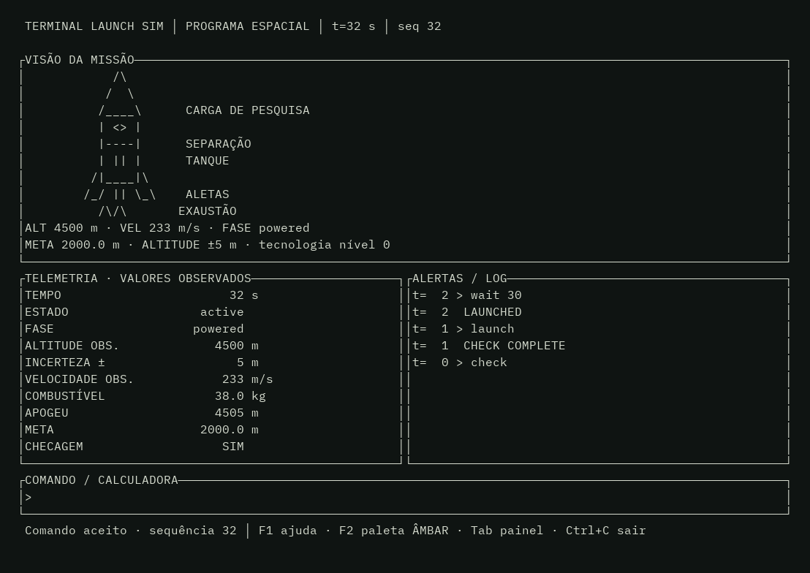
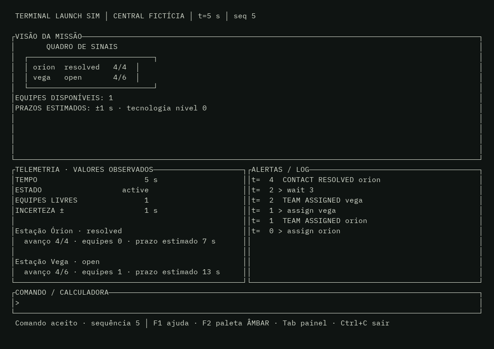
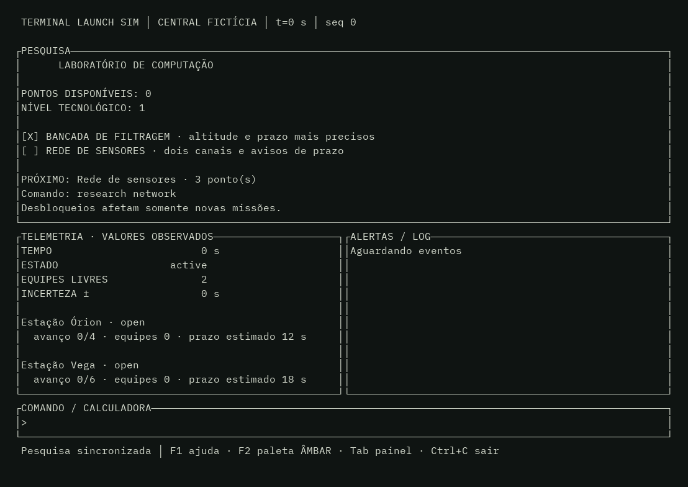
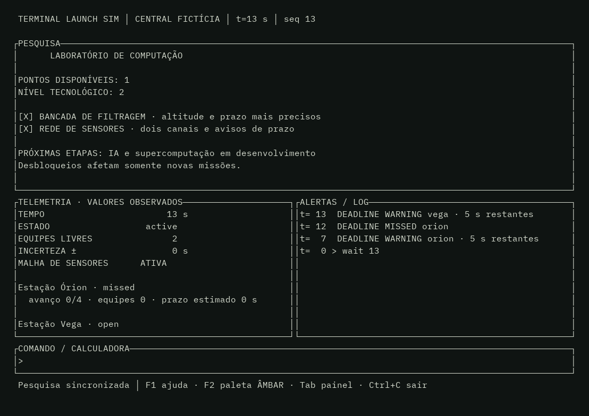
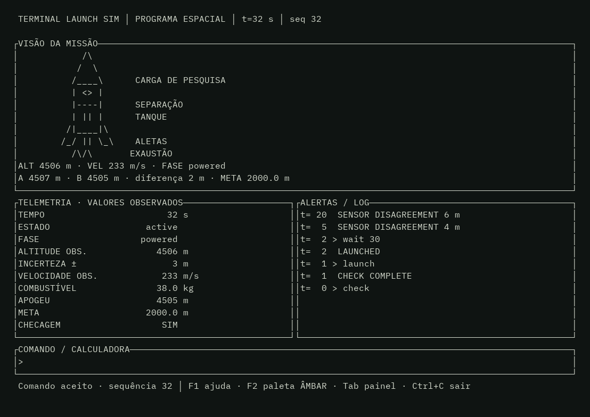

# Terminal Launch Sim

Protótipo de simulação educacional em terminal, com dois modos iniciais: voo vertical de pesquisa e exercício de coordenação de uma central fictícia. O motor é Elixir puro, usa passos de um segundo e aceita uma semente explícita para reproduzir eventos.

## Executar

Requer Elixir 1.20 e Erlang/OTP 29. A interface também requer Rust/Cargo. O motor usa Jason para o protocolo JSON.

Para jogar na interface Ratatui:

```sh
cd frontend
cargo run
```

O cliente prepara as dependências Elixir e compila o motor automaticamente antes de abrir o terminal. Pressione `1` ou `2` para escolher o modo, `F1` para ajuda e `Ctrl+C` para sair. Veja os [controles completos](frontend/README.md).

## Telas do jogo

Capturas da TUI em execução, geradas em um terminal de 106 × 32 caracteres:

| Programa espacial | Central fictícia |
| --- | --- |
|  |  |







As imagens podem ser atualizadas com `cargo build --manifest-path frontend/Cargo.toml` e `python scripts/capture_screens.py`. O script de captura requer Pillow, pyte e uma fonte monoespaçada acessível por `fc-match`; essas ferramentas não são necessárias para jogar.

Para usar o console Elixir diretamente:

```sh
cd engine
mix deps.get
mix test
mix run -e 'Engine.CLI.main(System.argv())' -- space
mix run -e 'Engine.CLI.main(System.argv())' -- central
```

No modo espacial, use `check`, `launch` e `wait 100`. Na central, use `assign orion`, `assign vega` e `wait 10`. `help` lista os comandos e `quit` sai. Cada comando avança um segundo; `wait N` avança até N segundos ou o fim da missão. A interface mostra somente o estado observável; o estado interno fica disponível para testes e replay.

Na TUI, conclua uma missão inédita para receber pontos de pesquisa. Digite `tech` para ver o laboratório; `research filter` custa dois pontos, e `research network` custa três após a bancada. Use `central 43` ou `space 43` para iniciar outra semente com as melhorias. O perfil fica salvo em `~/.local/share/terminal-launch-sim/profile.json` ou no caminho de `TLS_PROFILE_PATH`.

## Estado do projeto

Este é um **protótipo de motor, protocolo e TUI**, não a V1 definida em [SPEC.md](SPEC.md). Já há dois cenários introdutórios, semente, eventos, observações, cálculos básicos, interface por teclado, filtragem e rede de sensores. Faltam campanhas e tutoriais, as etapas de IA e supercomputação, persistência SQLite de partidas, recuperação de partidas, validação científica mais ampla e distribuição. O perfil de pesquisa usa JSON local nesta etapa. Os modelos e limites atuais estão em [docs/MODELS.md](docs/MODELS.md), e a árvore planejada em [docs/PROGRESSION.md](docs/PROGRESSION.md).

## Estrutura

- `engine/lib/engine.ex`: passo determinístico, semente e replay.
- `engine/lib/engine/space.ex`: voo vertical educacional.
- `engine/lib/engine/central.ex`: exercício fictício de alocação de equipes.
- `engine/lib/engine/calculator.ex`: dois cálculos com unidade e hipótese.
- `engine/lib/engine/cli.ex`: console para experimentar os cenários.
- `engine/test/simulation_test.exs`: reprodução, decisões e limites básicos.
- `protocol/README.md`: contrato JSONL local entre motor e interface.
- `frontend/`: cliente Rust/Ratatui com ajuda, instrumentos, eventos e calculadora.

## Próximas etapas

1. Fechar contrato de produto e modelos de referência de ambas as campanhas.
2. Criar catálogo versionado, tutorial e mais de um cenário por modo.
3. Implementar persistência e retomada de partidas, ampliar o protocolo e evoluir a TUI conforme a especificação.
